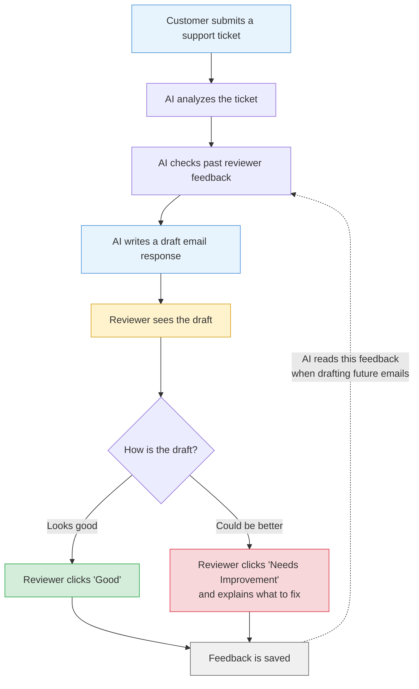
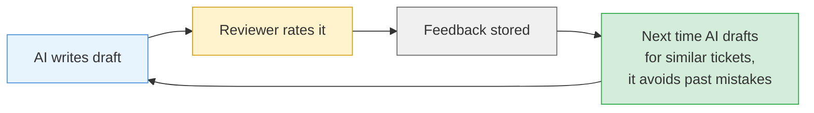
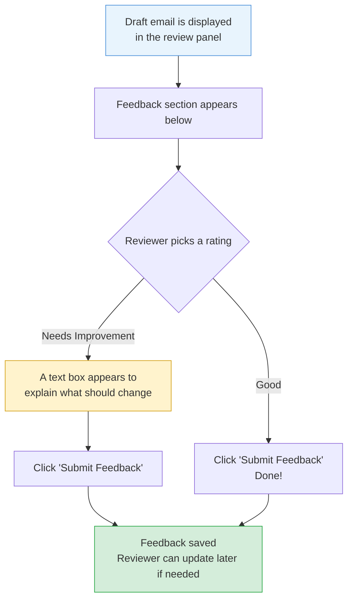
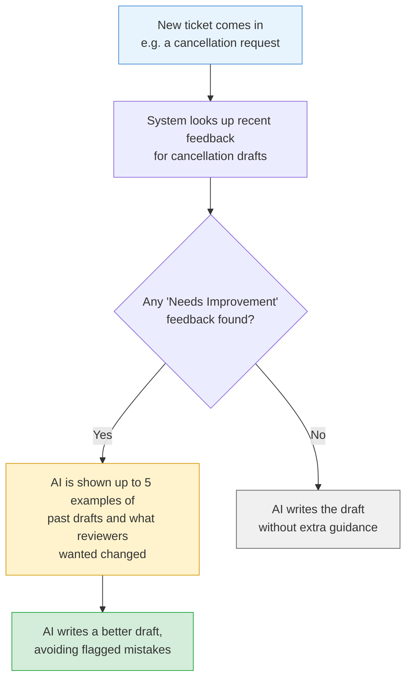

# Draft Email Feedback System

## What Is This?

When a customer support ticket comes in, our AI writes a draft email response for the reviewer. This feature lets reviewers **rate those drafts** and leave feedback. The AI then **learns from that feedback** to write better drafts over time.

---

## How It Works

---

## The Learning Loop

> **Example:** If a reviewer flags that refund emails sound too robotic, future refund draft emails will use a warmer, more empathetic tone.

---

## What the Reviewer Sees

---

## How the AI Uses Feedback

---

## Key Points

- **One rating per ticket** — reviewers can update their feedback anytime
- **Category-aware** — feedback on cancellation drafts improves future cancellation drafts first
- **Automatic** — no manual setup needed; the AI picks up feedback as reviewers submit it
- **Privacy-safe** — only the draft excerpt and feedback text are shared with the AI, no customer data
