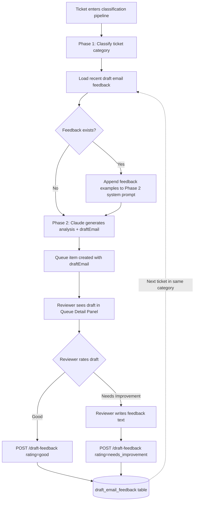
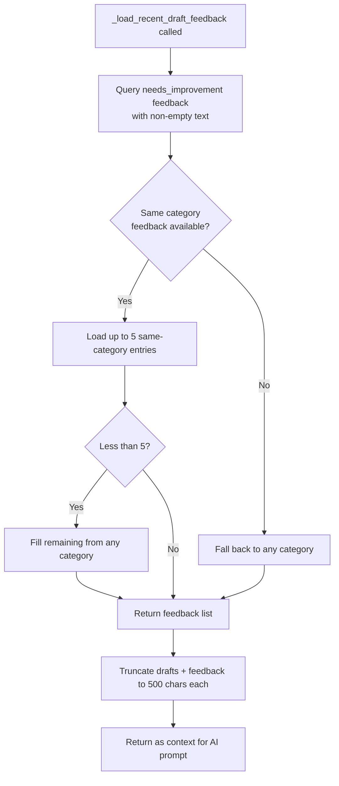
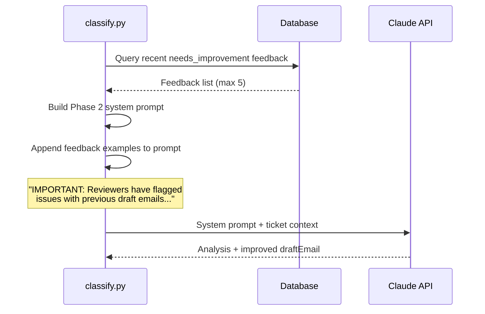
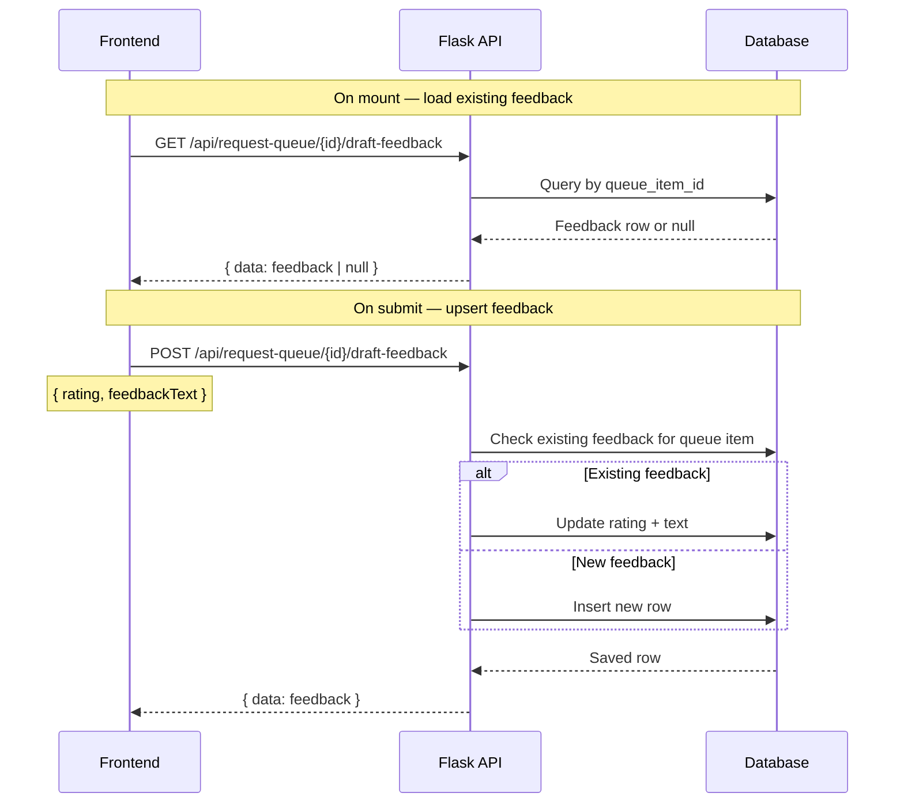
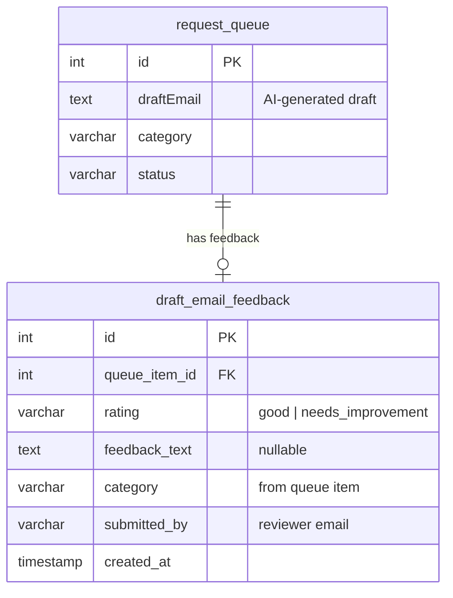

# Draft Email Feedback System

## Overview

Reviewers rate AI-generated draft emails and provide feedback. Recent negative feedback is injected into the AI prompt so future drafts improve over time.

## End-to-End Flow



## Feedback Loading Strategy



## AI Prompt Injection



## API Endpoints



## Data Model



## Frontend Component

```mermaid
stateDiagram-v2
    [*] --> Loading: Component mounts
    Loading --> NoFeedback: GET returns null
    Loading --> Saved: GET returns existing feedback

    NoFeedback --> GoodSelected: Click "Good"
    NoFeedback --> NeedsImprovementSelected: Click "Needs Improvement"

    Saved --> GoodSelected: Click "Good" (re-edit)
    Saved --> NeedsImprovementSelected: Click "Needs Improvement" (re-edit)

    GoodSelected --> Submitting: Click "Submit Feedback"
    NeedsImprovementSelected --> TextEntry: Textarea appears
    TextEntry --> Submitting: Click "Submit Feedback"

    Submitting --> Saved: POST succeeds
