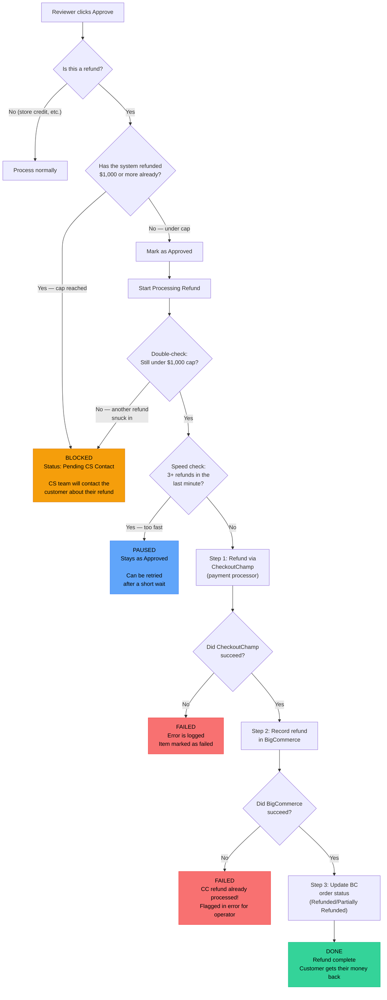

# How Refunds Work

This document explains what happens when a refund is approved in the CS Automation Hub.

## Refund Types Covered

| Type | What It Does |
|------|-------------|
| **Full Refund** | Returns the full order amount to the customer |
| **Partial Refund** | Returns a portion of the order amount |
| **Cancel + Refund** | Cancels the order and returns the full amount |

> **Not affected:** Store credits and gift certificates have no limits.

## Safety Limits

| Rule | Limit | What Happens When Hit |
|------|-------|-----------------------|
| **Spending Cap** | $1,000 total (all time) | Refund is blocked. CS team must handle it manually. |
| **Speed Limit** | 3 refunds per minute | Refund is paused briefly and can be retried. |

## Refund Flow

## Three-Step Refund Execution

Refunds are processed through two external systems in sequence:

| Step | System | What Happens | If It Fails |
|------|--------|-------------|-------------|
| 1 | **CheckoutChamp** | Actual payment refund via `POST /order/refund/` | Execution stops — no BigCommerce changes |
| 2 | **BigCommerce** | Records the refund via payment_actions/refunds API | CC refund already processed — flagged in error result (`checkoutchampRefundCompleted: true`) |
| 3 | **BigCommerce** | Updates order status to Refunded (4) or Partially Refunded (14) | Warning logged, non-fatal — refund is still complete |

**Why CheckoutChamp first?** CheckoutChamp is the actual payment processor. BigCommerce only tracks the refund in its system. If we refunded on BC first without CC, the customer would never actually receive their money.

**Partial failure handling:** If Step 1 succeeds but Step 2 fails, the error result includes `checkoutchampRefundCompleted: true` and the CC response, so operators know the customer was already refunded even though the queue item shows "failed."

### Write Override Guards

All three steps are protected by system override kill switches:
- **CheckoutChamp**: `checkoutchampWriteBlocked` (checked via `assert_checkoutchamp_write_allowed()`)
- **BigCommerce**: `bigcommerceWriteBlocked` (checked via `assert_bigcommerce_write_allowed()`)

Both must be unblocked for refunds to execute.

## What Each Status Means

| Status | Meaning | What To Do |
|--------|---------|-----------|
| **Pending CS Contact** | Refund was blocked because the $1,000 cap was reached | CS team needs to handle this refund manually and contact the customer |
| **Approved** | Refund is approved and ready to process (or was paused by speed limit) | If paused, it can be retried after a short wait |
| **Completed** | Refund went through successfully | Nothing — the customer will receive their money |
| **Failed** | Something went wrong during processing | Check the error details and retry or escalate |

## Why Two Checks?

The system checks the $1,000 cap **twice** — once when the reviewer clicks Approve, and again right before the refund is processed. This is because another refund could be processed in between those two steps, which would push the total over the limit.

## Frequently Asked Questions

**Q: What counts toward the $1,000 cap?**
Only actual payment refunds (full, partial, and cancel+refund). Store credits and gift certificates do not count.

**Q: Is the $1,000 cap per customer?**
No, it is a system-wide cap across all customers.

**Q: What happens when a refund is paused by the speed limit?**
The item stays in "Approved" status. It can be retried after about a minute. This limit exists to prevent accidental rapid-fire refunds.

**Q: Can the $1,000 cap be reset?**
Not automatically. It tracks all refunds ever processed through the system. Manual intervention is required to handle refunds beyond this cap.
