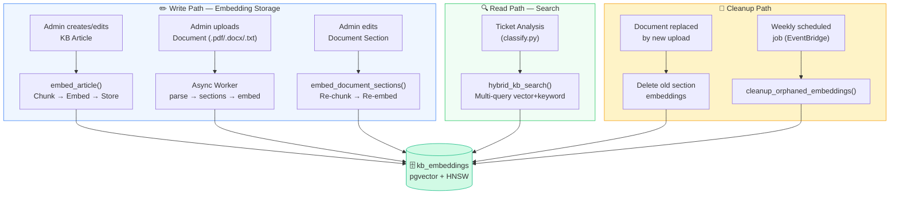
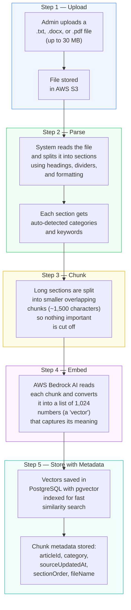
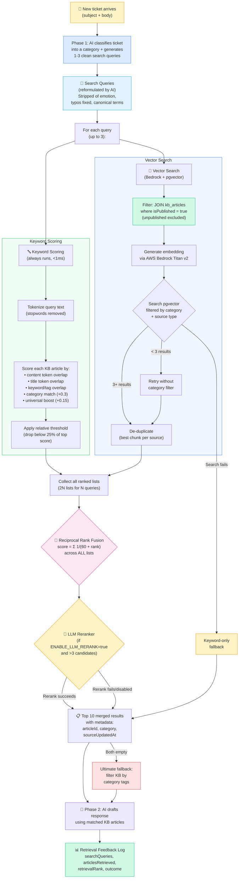
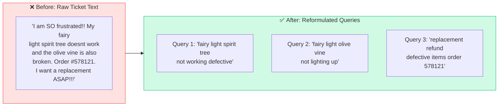
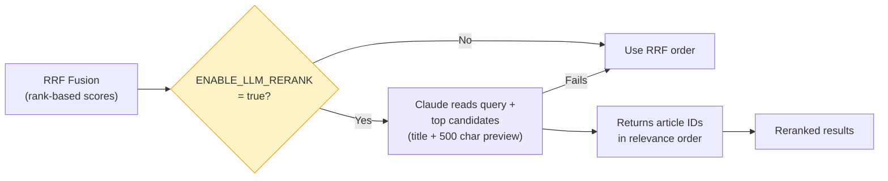
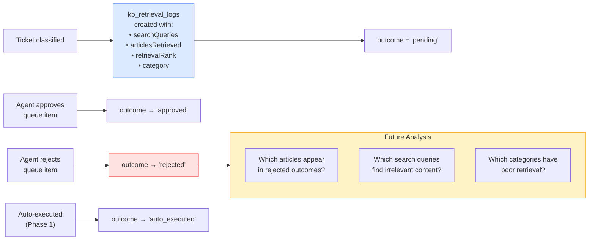
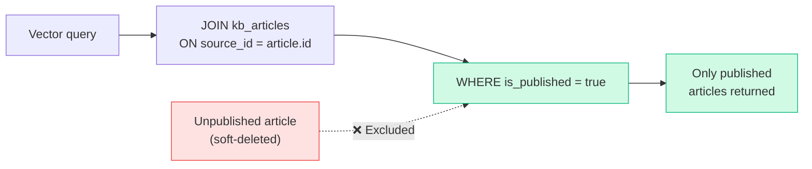
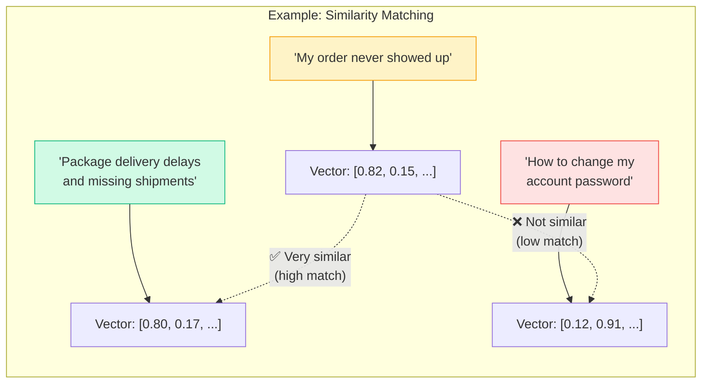
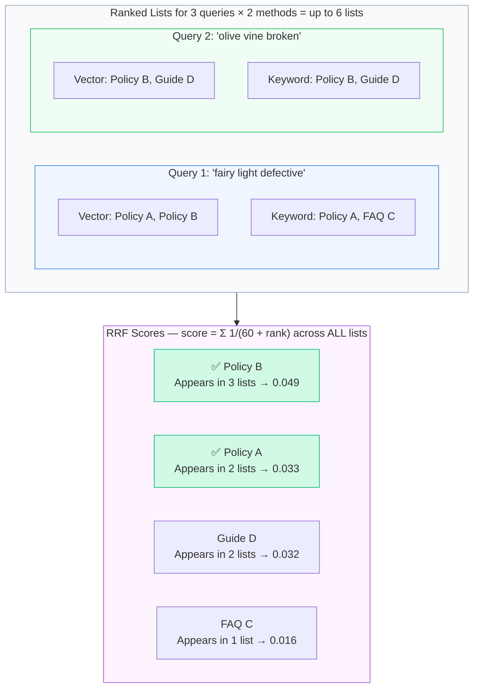

# How Hybrid KB Search Works

The Knowledge Base (KB) uses **hybrid search** — combining **vector search** (semantic meaning) with **keyword scoring** (exact token matching) — to find the most relevant help articles for each customer ticket. Results from both methods are merged using **Reciprocal Rank Fusion (RRF)**, then optionally reranked by an LLM.

---

## The Big Picture

```mermaid
flowchart LR
    A["📄 KB Document\nUploaded by Admin"] --> B["🔍 Parsed into\nSections"]
    B --> C["🧩 Split into\nSmall Chunks"]
    C --> D["🧠 AI Converts to\nNumber Vectors"]
    D --> E[("🗄️ Vector\nDatabase")]

    F["🎫 Customer Ticket\nComes In"] --> P1["🏷️ Phase 1\nAI Classification"]
    P1 --> Q["📝 Reformulated\nSearch Queries"]
    Q --> G1["🧠 Vector Search\n(semantic meaning)"]
    Q --> G2["🔤 Keyword Search\n(token matching)"]
    E --> G1
    G1 --> H{"🔀 Reciprocal Rank\nFusion (RRF)"}
    G2 --> H
    H --> R["🎯 LLM Reranker\n(optional)"]
    R --> I["📋 Top Matching\nKB Sections"]
    I --> J["🤖 AI Writes\nResponse Using\nMatched KB"]
    J --> FB["📊 Retrieval\nFeedback Log"]

    style A fill:#dbeafe,stroke:#3b82f6
    style F fill:#fef3c7,stroke:#f59e0b
    style E fill:#d1fae5,stroke:#10b981
    style P1 fill:#dbeafe,stroke:#3b82f6
    style Q fill:#e0f2fe,stroke:#0ea5e9
    style H fill:#fce7f3,stroke:#ec4899
    style R fill:#fef3c7,stroke:#f59e0b
    style J fill:#ede9fe,stroke:#8b5cf6
    style FB fill:#f0fdf4,stroke:#22c55e
```

---

## Where Vector Search is Used

Vector search is **not** just used during ticket analysis. The system reads and writes to the vector database in three distinct flows:

### Trigger Summary

| Trigger | Function | File | Direction |
|---------|----------|------|-----------|
| Create KB article | `embed_article()` | `routes/knowledge_base.py` | Write |
| Update KB article | `embed_article()` | `routes/knowledge_base.py` | Write |
| Upload document (small) | `embed_document_sections()` | `routes/settings.py` | Write |
| Upload document (large) | `embed_document_sections()` | `async_worker.py` | Write |
| Edit document section | `embed_document_sections()` | `routes/settings.py` | Write |
| Analyze ticket | `hybrid_kb_search()` → `search_kb_vectors()` | `pipeline/classify.py` | Read |
| Document replaced | `delete(KbEmbedding)` | `async_worker.py`, `settings.py` | Delete |
| Weekly cleanup | `_cleanup_orphaned_embeddings()` | `async_worker.py` | Delete |

---

## Step-by-Step: Storing Knowledge

When an admin uploads a document or creates a KB article, the system prepares it for smart search.

---

## Step-by-Step: Finding Relevant KB Content for a Ticket

When a customer ticket is analyzed, the system finds the best KB content through a multi-stage retrieval pipeline.

---

## Query Reformulation

Raw ticket text (emotional language, typos, multi-issue threads) used to dilute search quality. Now the Phase 1 Claude call generates clean search queries alongside classification — zero additional latency cost.

Each query runs keyword + vector search independently. All ranked lists are fused through RRF, so multi-issue tickets find articles for **each** issue rather than a blended mess.

---

## LLM Reranking (Optional)

After RRF fusion, an optional LLM reranker can reorder candidates by actual relevance. Disabled by default for safe rollout.

| Detail | Value |
|--------|-------|
| **Trigger** | `ENABLE_LLM_RERANK=true` env var |
| **Min candidates** | >3 (skip if too few) |
| **Token budget** | ~1,650 tokens (~$0.005/call) |
| **Latency** | ~500-800ms |
| **Fallback** | Any failure → keep RRF order |

---

## Retrieval Feedback Loop

Every ticket analysis logs what was searched and retrieved. When agents approve or reject queue items, the outcome is recorded — enabling long-term retrieval quality analysis.

---

## isPublished Safety Filter

Vector search now JOINs the source table to exclude unpublished articles. Previously, soft-deleted articles (`isPublished=false`) still had embeddings in `kb_embeddings` and could appear in search results.

---

## What is a "Vector"?

A vector is a list of numbers that represents the _meaning_ of a piece of text. Texts with similar meanings have similar vectors — even if they use completely different words.

---

## How Reciprocal Rank Fusion (RRF) Works

RRF merges multiple ranked lists into one by assigning each item a score based on its position in each list. With multi-query search, there are 2N lists for N queries — items that appear across multiple queries and both search methods are heavily boosted.

---

## Chunk Metadata

Each embedding now stores rich metadata for downstream use (AI citation, staleness detection).

| Source Type | Metadata Fields |
|-------------|----------------|
| **Article** | `articleId`, `title`, `category`, `sourceUpdatedAt` |
| **Document Section** | `sectionId`, `heading`, `sectionOrder`, `sourceFileName`, `sourceUpdatedAt` |

Existing embeddings get enriched metadata on next re-embed (any article edit triggers `embed_article`). No migration needed.

---

## Key Details

| Setting | Value | What It Means |
|---|---|---|
| **Search method** | Hybrid (vector + keyword + RRF + optional LLM rerank) | Multi-stage retrieval pipeline |
| **Query reformulation** | AI generates 1-3 clean queries from raw ticket | Better search precision, multi-issue coverage |
| **Embedding model** | AWS Bedrock Titan v2 | The AI that converts text to vectors |
| **Vector size** | 1,024 numbers | How much meaning each vector captures |
| **Chunk size** | ~1,500 characters | How big each searchable piece of text is |
| **Chunk overlap** | 200 characters | Overlap between chunks to avoid losing context at boundaries |
| **Similarity threshold** | 0.3 (of 1.0) | Minimum relevance score for vector matches |
| **isPublished filter** | JOIN kb_articles WHERE is_published = true | Unpublished articles excluded from results |
| **RRF constant (k)** | 60 | Standard value from the RRF paper; higher = less emphasis on top ranks |
| **Keyword threshold** | Relative (25% of top) | Adapts to score distribution instead of fixed cutoff |
| **Stopwords** | ~60 English words | Removed from tokenization to improve keyword signal |
| **Max results** | 10 | How many KB pieces are sent to the AI per ticket |
| **Index type** | HNSW | Fast approximate search that scales to large datasets |
| **LLM reranker** | Off by default (`ENABLE_LLM_RERANK=true` to enable) | Cross-encoder style relevance reranking |
| **Feedback tracking** | `kb_retrieval_logs` table | Tracks search queries, retrieved articles, and outcome |
| **Fallback chain** | Keyword-only → category filter | Graceful degradation if vector search unavailable |
