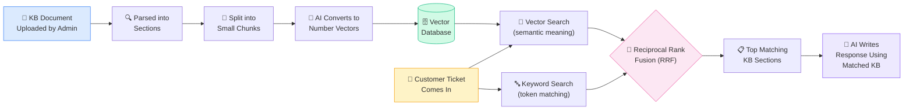
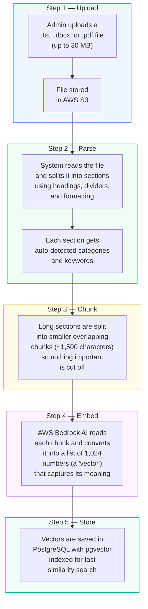
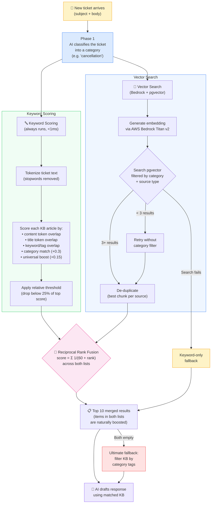
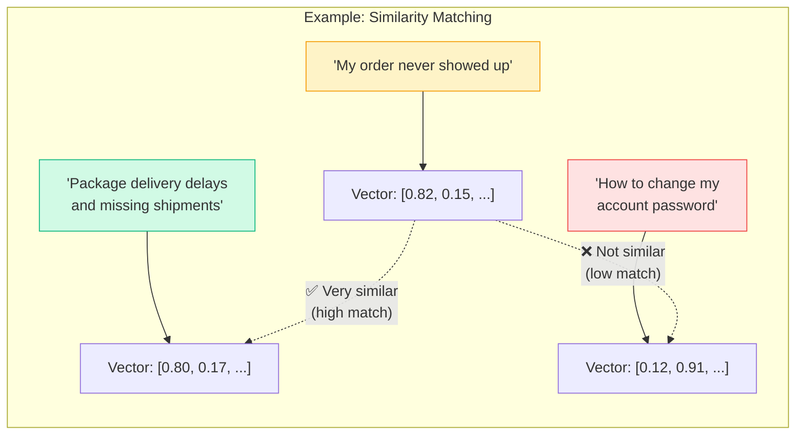
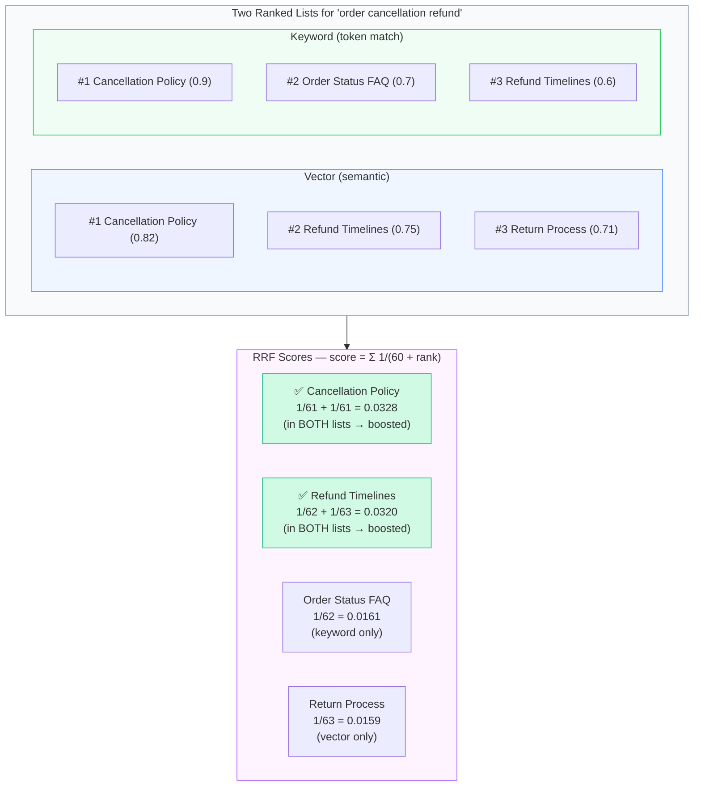

# How Hybrid KB Search Works

The Knowledge Base (KB) uses **hybrid search** — combining **vector search** (semantic meaning) with **keyword scoring** (exact token matching) — to find the most relevant help articles for each customer ticket. Results from both methods are merged using **Reciprocal Rank Fusion (RRF)**, so articles that appear in both rankings are naturally boosted.

---

## The Big Picture

---

## Step-by-Step: Storing Knowledge

When an admin uploads a document or creates a KB article, the system prepares it for smart search.

---

## Step-by-Step: Finding Relevant KB Content for a Ticket

When a customer ticket is analyzed, the system finds the best KB content to inform the AI response using both search methods in parallel.

---

## What is a "Vector"?

A vector is a list of numbers that represents the _meaning_ of a piece of text. Texts with similar meanings have similar vectors — even if they use completely different words.

---

## How Reciprocal Rank Fusion (RRF) Works

RRF merges two ranked lists into one by assigning each item a score based on its position in each list. Items that appear in _both_ lists are naturally boosted without any weight tuning.

## Key Details

| Setting | Value | What It Means |
|---|---|---|
| **Search method** | Hybrid (vector + keyword + RRF) | Both methods run, results fused |
| **Embedding model** | AWS Bedrock Titan v2 | The AI that converts text to vectors |
| **Vector size** | 1,024 numbers | How much meaning each vector captures |
| **Chunk size** | ~1,500 characters | How big each searchable piece of text is |
| **Chunk overlap** | 200 characters | Overlap between chunks to avoid losing context at boundaries |
| **Similarity threshold** | 0.3 (of 1.0) | Minimum relevance score for vector matches |
| **RRF constant (k)** | 60 | Standard value from the RRF paper; higher = less emphasis on top ranks |
| **Keyword threshold** | Relative (25% of top) | Adapts to score distribution instead of fixed cutoff |
| **Stopwords** | ~60 English words | Removed from tokenization to improve keyword signal |
| **Max results** | 10 | How many KB pieces are sent to the AI per ticket |
| **Index type** | HNSW | Fast approximate search that scales to large datasets |
| **Fallback chain** | Keyword-only → category filter | Graceful degradation if vector search unavailable |
